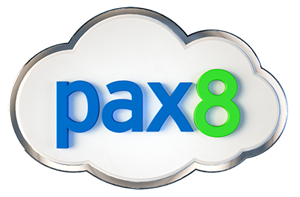

</img>
</img>&nbsp;&nbsp;
</img>

# Azure Boot Camp

Hello, you've reached the **Pax8 Azure Bootcamp** site.  Here you will find the labs and presentations covered during the bootcamp.  The labs for the  bootcamp are linked below and are broken down into the following distinct areas:

## 1. Azure and the Microsoft Hybrid Strategy
- [Hybrid Strategy Presentation](1%20-%20Azure%20Bootcamp%20-%20Azure%20and%20the%20Microsoft%20Hybrid%20Strategy.pdf)

## 2. Identity
- [Identity Presentation](2%20-%20Azure%20Bootcamp%20-%20Hybrid%20Identity.pdf)
> **Labs**
- [Identity - Lab 1 - AD Connect Infrastructure Setup](Identity%20Lab%201%20-%20AD%20Connect%20Infrastructure%20Setup.md)
- [Identity - Lab 2 - Pass Thru Authentication and High Availability (optional)](Identity%20Lab%202%20-%20AD%20Connect%20High%20Availability%20(Optional).md)
- [Identity - Lab 3 - Password single sign-on for an Azure AD gallery application (optional)](Identity%20Lab%203%20-%20AD%20Connect%20Publishing%20a%20SSO%20Application%20(Optional).md)
  

## 3. Networking
[Networking Presentation](3%20-%20Azure%20Bootcamp%20-%20Networking.pdf)
> **Labs**
- [Networking - Lab 1 - Virtual Networks](Networking%20Lab%201%20-%20Virtual%20Networks.md)
- [Networking - Lab 2 - Load Balancer](Networking%20Lab%202%20-%20Load%20Balancer.md)
- [Networking - Lab 3 - Network Watcher](Networking%20Lab%203%20-%20Network%20Watcher.md)
- [Networking - Lab 4 - Traffic Manager](Networking%20Lab%204%20-%20Traffic%20Manager.md)
- [Networking - Lab 5 - Hub and Spoke (optional)](Networking%20Lab%205%20-%20Hub%20and%20Spoke%20Challenge%20(Optional).md)
  

## 4. Azure Migrate
[Migration Presentation](4%20-%20Azure%20Bootcamp%20-%20Migration.pdf)
> **Labs**
- [Migration - Lab 1 - Database Migration Assistant (DMA)](Migration%20Lab%201%20-%20Database%20Migration%20Service%20(DMS).md)
- [Migration - Lab 2 - Azure Site Recovery for Migration](Migration%20Lab%202%20-%20Azure%20Site%20Recovery%20(ASR).md)
- [Migration - Lab 3 - Azure Policy](Migration%20Lab%203%20-%20Azure%20Policy.md)
- [Migration - Lab 4 - Azure Migrate (optional)](Migration%20Lab%204%20-%20Azure%20Migrate%20(Optional).md)
  

## 5. Azure Storage
[Storage Presentation](5%20-%20Azure%20Bootcamp%20-%20Storage.pdf)
> **Labs**
- [Storage - Lab 1 - Creating Data Disks](Storage%20Lab%201%20-%20Creating%20Data%20Disks.md)
- [Storage - Lab 2 - Storage: VM and Disk Sizing](Storage%20Lab%202%20-%20VM%20and%20Disk%20Sizing.md)
- [Storage - Lab 3 - Storage: Azure Files](Storage%20Lab%203%20-%20Azure%20Files.md)

  

<a href="http://wingman2020.com"></img></a>

  

[Back](./)

